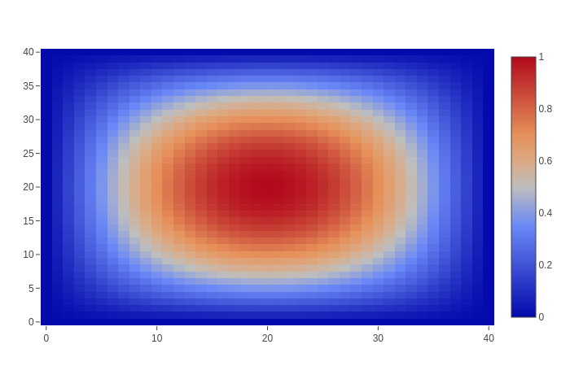
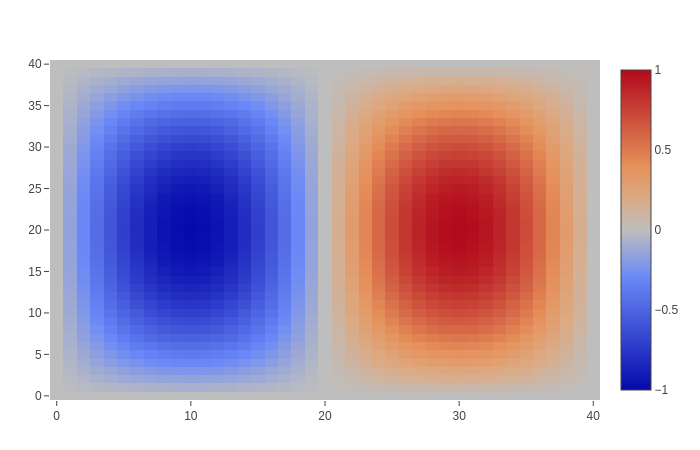
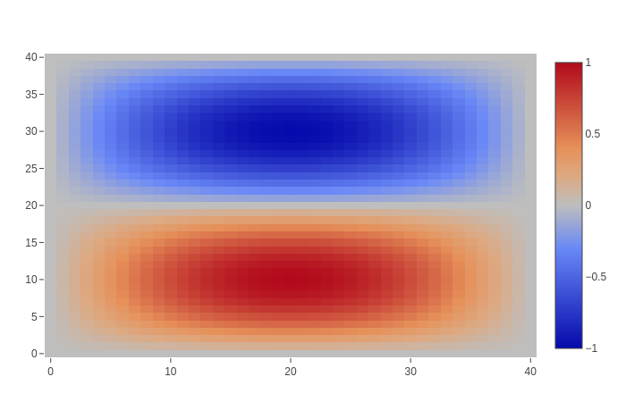
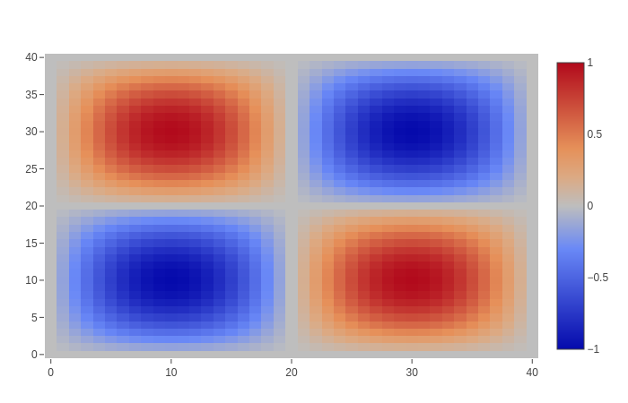

# DiscreteExteriorCalculus.jl

[travis-img]: https://travis-ci.com/rigetti/DiscreteExteriorCalculus.jl.svg?branch=master
[travis-url]: https://travis-ci.com/rigetti/DiscreteExteriorCalculus.jl

[![][travis-img]][travis-url]

DiscreteExteriorCalculus.jl is a package implementing [Discrete Exterior Calculus](https://en.wikipedia.org/wiki/Discrete_exterior_calculus). Data structures for cell complexes, primal, and dual meshes are provided along with implementations of the [exterior derivative](https://en.wikipedia.org/wiki/Exterior_derivative),
[hodge star](https://en.wikipedia.org/wiki/Hodge_star_operator), [codifferential](https://en.wikipedia.org/wiki/Hodge_star_operator#On_manifolds), and [Laplace-de Rham](https://en.wikipedia.org/wiki/Laplace%E2%80%93Beltrami_operator#Laplace%E2%80%93de_Rham_operator) operators.

## Installation

Clone the repository from GitHub and install Julia 1.12, or another Julia version
allowed by `Project.toml`. No build is required beyond the default Julia package
precompilation.

```julia
using Pkg
Pkg.activate(".")
Pkg.instantiate()
Pkg.test()
```

## Supported mesh cells

The original simplex-based workflow remains supported for triangles,
tetrahedra, and higher-dimensional simplices through `Simplex`, `CellComplex`,
and `TriangulatedComplex`.

The package also provides constructors for non-simplex cells while preserving
those cells in the primal complex:

- `polygonal_complex(polygons)` for ordered 2D polygon cells.
- `quadrilateral_complex(...)` / `quad_complex(...)` for ordered 2D quadrilateral cells.
- `hexagonal_complex(...)` / `hexagon_complex(...)` for ordered 2D hexagonal cells.
- `hexahedral_complex(...)` for 3D hexahedron cells.
- `prismatic_complex(...)` / `prism_complex(...)` for 3D triangular-prism cells.

For indexed connectivity, pass the point array and cell connectivity:

```julia
points = [
    Point(0, 0), Point(1, 0), Point(2, 0),
    Point(0, 1), Point(1, 1), Point(2, 1),
]

quads = [
    [1, 2, 5, 4],
    [2, 3, 6, 5],
]

tcomp = quadrilateral_complex(points, quads)
mesh = Mesh(tcomp, centroid)
```

Non-simplex cells are stored as `Cell`s in the primal complex. Their geometric
measures are computed from an internal simplex decomposition:

- 2D polygons are fan-triangulated from the first vertex.
- 3D hexahedra and triangular prisms use fixed tetrahedral decompositions.

Vertices must be ordered along each cell boundary. Polygon cells should be
simple and non-self-intersecting for the fan triangulation to represent the
intended area.

## Cell centers

Dual mesh construction takes a center function such as `centroid` or
`circumcenter(m)`.

For simplex cells, `circumcenter(m)` is the usual metric circumcenter: the point
whose metric distance to all simplex vertices is equal.

For non-simplex cells, an exact circumcenter may not exist. In that case
`circumcenter(m)` uses a best-fit circumcenter in the cell's affine hull. If
`x0` is the first vertex, `v_i = x_i - x0`, `M` is the metric matrix, and `U`
is a basis for the cell affine hull, the center is written as:

```text
x0 + U y
```

where `y` solves the overdetermined linear system:

```text
2 v_i' M U y = v_i' M v_i
```

For cyclic or cospherical cells such as rectangles and cubes, this recovers the
usual circumcenter. For general distorted polygons or polyhedra, it is a
least-squares center and is not guaranteed to lie inside the cell. Use
`centroid` when an always-inside average point is more appropriate for the
application.

## Example usage: modes of the Laplace-de Rham operator on a rectangle with Dirichlet boundary conditions

See `test/test_laplacian_rectangle.jl` for a more complete version of this example. Also see [DiscretePDEs.jl](https://github.com/rigetti/DiscretePDEs.jl) for more examples.

Import packages.
```julia
using DiscreteExteriorCalculus
const DEC = DiscreteExteriorCalculus
using LinearAlgebra: eigen
using AdmittanceModels: sparse_nullbasis
using Base.Iterators: product
using PlotlyJS: plot, heatmap
```

Create a rectangular grid that is r1×r2, then subdivide each rectangle into two triangles. Collect these into a cell complex.
```julia
r1, r2 = .5, .4
num = 40
points, tcomp = DEC.triangulated_lattice([r1, 0], [0, r2], num, num)
```

Orient the cell complex positively and compute the dual mesh.
```julia
orient!(tcomp.complex)
m = Metric(2)
mesh = Mesh(tcomp, circumcenter(m))
```

Compute the Laplace-de Rham operator for 0-forms and a sparse nullbasis for the constraint that the 0-form goes to 0 on the boundary.
```julia
laplacian = differential_operator(m, mesh, "Δ", 1, true)
comp = tcomp.complex
_, exterior = boundary_components_connected(comp)
constraint = zero_constraint(comp, exterior.cells[1], 1)
nullbasis = sparse_nullbasis(constraint)
```

Compute the eigenvalues and eigenvectors of the restricted Laplace-de Rham operator.
```julia
vals, vects = eigen(collect(transpose(nullbasis) * laplacian * nullbasis))
inds = sortperm(vals)
vals, vects = vals[inds], vects[:, inds]
```

Lift the eigenvectors back to the original space and reshape for plotting.
```julia
comp_points = [c.points[1] for c in comp.cells[1]]
ordering = [findfirst(isequal(p), comp_points) for p in points]
vs = [collect(transpose(reshape((nullbasis * vects[:,i])[ordering],
    num+1, num+1))) for i in 1:size(vects, 2)]
for i in 1:length(vs)
    j = argmax(abs.(vs[i]))
    vs[i] /= vs[i][j]
end
```

Plot the first eigenvector.
```julia
plot(heatmap(z=vs[1]))
```



Plot the second eigenvector.
```julia
plot(heatmap(z=vs[2]))
```



Plot the third eigenvector.
```julia
plot(heatmap(z=vs[3]))
```



Plot the fourth eigenvector.
```julia
plot(heatmap(z=vs[4]))
```



And so on.
